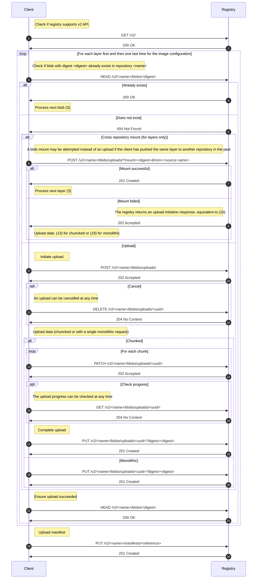
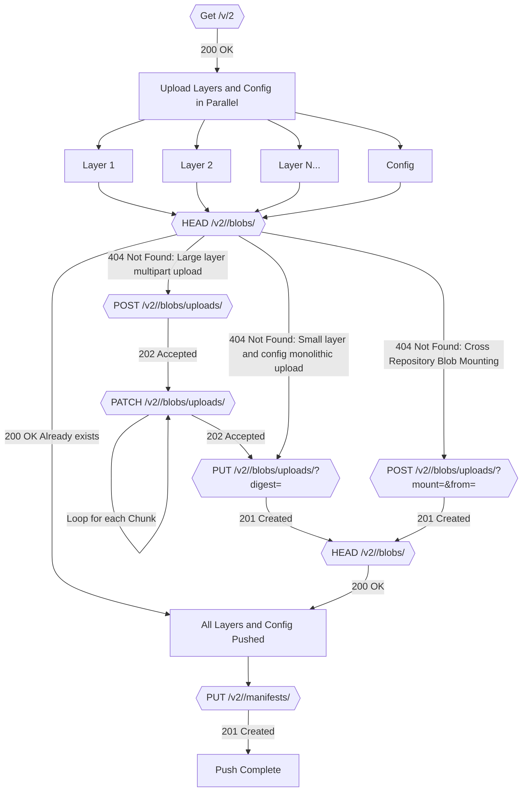
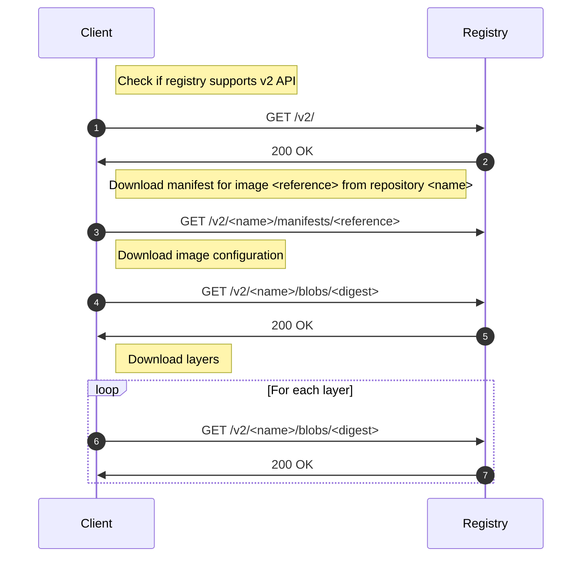

# Request Flow

This document illustrates the flow of API requests for a Docker push/pull command.

## Push

```mermaid
sequenceDiagram
  autonumber
  participant C as Client
  participant R as Registry

  Note right of C: Check if registry supports v2 API
	C->>R: GET /v2/
  R->>C: 200 OK
  loop For each layer first and then one last time for the image configuration
    Note right of C: Check if blob with digest <digest> already exists in repository <name>
    C->>R: HEAD /v2/<name>/blobs/<digest>
    alt Already exists
      R->>C: 200 OK
      Note right of C: Process next blob (3)
    else Does not exist
      R->>C: 404 Not Found
      alt Cross repository mount (for layers only)
        Note right of C: A blob mount may be attempted instead of an upload if the client has pushed the same layer to another repository in the past
        C->>R: POST /v2/<name>/blobs/uploads/?mount=<digest>&from=<source name>
        alt Mount successful
          R->>C: 201 Created
          Note right of C: Process next layer (3)
        else Mount failed
          Note left of R: The registry returns an upload initiation response, equivalent to (10)
          R->>C: 202 Accepted
          Note right of C: Upload data: (13) for chuncked or (19) for monolithic
        end
      else Upload
        Note right of C: Initiate upload
        C->>R: POST /v2/<name>/blobs/uploads/
        R->>C: 202 Accepted
        opt Cancel
          Note right of C: An upload can be cancelled at any time
          C->>R: DELETE /v2/<name>/blobs/uploads/<uuid>
          R->>C: 204 No Content
        end
        Note right of C: Upload data (chuncked or with a single monolithic request)
        alt Chunked
          loop For each chunk
            C->>R: PATCH /v2/<name>/blobs/uploads/<uuid>
            R->>C: 202 Accepted
          end
          opt Check progress
            Note right of C: The upload progress can be checked at any time
            C->>R: GET /v2/<name>/blobs/uploads/<uuid>
            R->>C: 204 No Content
          end
          Note right of C: Complete upload
          C->>R: PUT /v2/<name>/blobs/uploads/<uuid>?digest=<digest>
          R->>C: 201 Created
        else Monolithic
          C->>R: PUT /v2/<name>/blobs/uploads/<uuid>?digest=<digest>
          R->>C: 201 Created
        end
      end
      Note right of C: Ensure upload succeeded
      C->>R: HEAD /v2/<name>/blobs/<digest>
      R->>C: 200 OK
    end
  end
  Note right of C: Upload manifest
  C->>R: PUT /v2/<name>/manifests/<reference>
  R->>C: 201 Created
```

## Push Flow Diagram Errors Omitted

```mermaid
graph TD
    c{{Get /v/2}};
    d{{HEAD /v2/<name>/blobs/<digest>}};
    e{{POST /v2/<name>/blobs/uploads/}};
    f{{PATCH /v2/<name>/blobs/uploads/<uuid>}};
    g{{PUT /v2/<name>/blobs/uploads/<uuid>?digest=<digest>}};
    h{{POST /v2/<name>/blobs/uploads/?mount=<digest>&from=<source name>}};
    i{{HEAD /v2/<name>/blobs/<digest>}};
    j{{PUT /v2/<name>/manifests/<reference>}};
    l1[Layer 1];
    l2[Layer 2];
    l3[Layer N...];
    c1[Config];
    c -- 200 OK --> p[Upload Layers and Config in Parallel];
    p --> l1;
    p --> l2;
    p --> l3;
    p --> c1;
    l1 --> d;
    l2 --> d;
    l3 --> d;
    c1 --> d;
    d -- 200 OK Already exists --> pe;
    d -- 404 Not Found: Large layer multipart upload --> e;
    e -- 202 Accepted --> f;
    f -- Loop for each Chunk --> f;
    f -- 202 Accepted --> g;
    g -- 201 Created --> i;
    d -- 404 Not Found: Small layer and config monolithic upload --> g;
    d -- 404 Not Found: Cross Repository Blob Mounting --> h;
    h -- 201 Created -->i;
    i -- 200 OK --> pe[All Layers and Config Pushed];
    pe --> j;
    j -- 201 Created -->z[Push Complete];
```

## Pull

```mermaid
sequenceDiagram
  autonumber
  participant C as Client
  participant R as Registry

  Note right of C: Check if registry supports v2 API
	C->>R: GET /v2/
  R->>C: 200 OK
  Note right of C: Download manifest for image <reference> from repository <name>
  C->>R: GET /v2/<name>/manifests/<reference>
  Note right of C: Download image configuration
  C->>R: GET /v2/<name>/blobs/<digest>
  R->>C: 200 OK
  Note right of C: Download layers
  loop For each layer
    C->>R: GET /v2/<name>/blobs/<digest>
    R->>C: 200 OK
  end
```
